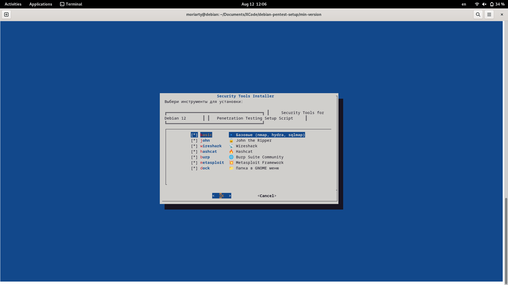

<p align="center">
  
  <h1 align="center">debian-pentest-setup</h1>
  <p align="center">
    Automated pentest tools installer for Debian 12 (Bookworm) with GNOME.
  </p>
</p>

<p align="center">
  <a href="https://github.com/Trytonottry/debian-pentest-setup/stargazers">
    
  </a>
  <a href="https://github.com/Trytonottry/debian-pentest-setup/issues">
    
  </a>
  <a href="https://github.com/Trytonottry/debian-pentest-setup/blob/main/LICENSE">
    
  </a>
  
  
  
</p>

---
## 🖼 Скриншот



> Меню с выбором инструментов: Burp, John, Metasploit и другие.

### 🚀 Описание
Автоматический установщик инструментов для тестирования на проникновение на **Debian 12 (Bookworm)**.  
Устанавливает: `Burp Suite`, `John the Ripper`, `Metasploit`, `Nmap`, `Wireshark`, `Hashcat`, `Hydra`, `Sqlmap`  
и создаёт удобную папку **"Security Tools"** в меню GNOME.

Идеально подходит для:
- Этического хакинга
- Подготовки лабораторий
- Red Team / Pentest рабочих станций

### 🛠 Дополнительные утилиты

| Скрипт | Описание |
|-------|---------|
| `tools/pentest-profile.sh` | Запускает режим пентеста |
| `tools/demo-mode.sh` | Демо с фейковыми данными |
| `tools/uninstall.sh` | Полное удаление |
| `tools/update-tools.sh` | Обновление всех инструментов |

---

### 📦 Установка
```bash
git clone https://github.com/Trytonottry/debian-pentest-setup.git
cd debian-pentest-setup
chmod +x install.sh
./install.sh
```
 
    💡 Скрипт запустит интерактивное меню, где можно выбрать нужные инструменты. 
     
### ⚠️ Предупреждение 

Этот проект предназначен только для обучения и авторизованного тестирования.
Не используй для несанкционированного доступа. 
 
### 🤝 Вклад 

Любые улучшения приветствуются!
Открой Issue или Pull Request. 
 
### 📄 Лицензия 

MIT © Trytonottry
